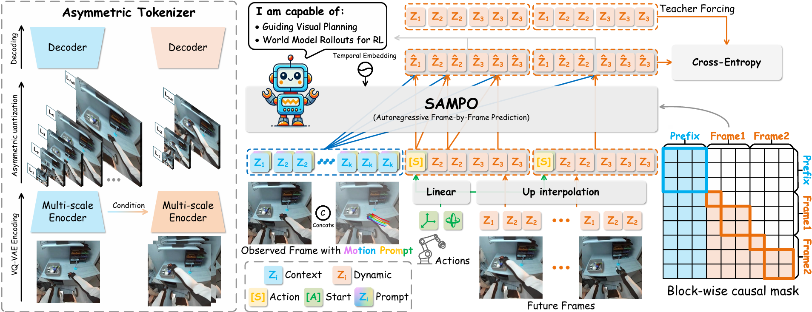

<div align="center">

# SAMPO++

### Unified Temporal Autoregression and Scale-Wise Flow Matching for Embodied World Models

Sen Wang · Sanping Zhou · Huaiyi Dong · Kun Xia · Gang Hua · Le Wang

*Institute of Artificial Intelligence and Robotics, Xi'an Jiaotong University*

[](https://sanmumumu.github.io/SAMPO_plus_plus/)
[](https://www.python.org/)
[](https://pytorch.org/)
[](LICENSE)

</div>

---

## Overview

SAMPO++ is an **action-conditioned world model** for embodied agents. Our central thesis is that such a model should be designed not as an action-conditioned *video generator*, but as a

> **scale-decoupled, action-controlled, closed-loop-stable dynamical system.**

We instantiate this view by coupling an **inter-frame temporal autoregressive planner** with an **intra-frame scale-wise flow-matching renderer** in a fully continuous latent space, under a *Predict-then-Refine* paradigm. Three components follow from the thesis rather than from stacking modules:

| Component | Idea | Replaces |
|---|---|---|
| **Multi-scale Temporal Planner** | The recurrent state is itself multi-scale: the planner reasons over the *entire* latent pyramid and emits one plan state per scale, so coarse global dynamics and fine local detail are tracked by separate pathways. | single global plan vector |
| **Action-Controlled Velocity Field (ACVF)** | The action *steers the flow velocity* as a bounded, spatially-masked, **zero-initialized** residual on top of an action-free passive drift. The residual is **provably zero under the no-op action** and is trained with no-op and counterfactual objectives. | affine action modulation (AdaLN/ADM) |
| **Pyramid-Consistent Dynamic RoPE (PCD-RoPE)** | All scales share a single resolution-normalized **physical** coordinate frame with **scale-specific frequency bands**, removing the implausible reuse of one rotary frequency across a `1×1` and a `16×16` grid. | 4-D Scale-Aware RoPE |

Long-horizon drift is attacked at its source via **rollout-aware training** (scheduled self-forcing), and the model is evaluated with **world-model-native metrics** (action alignment, counterfactual accuracy, no-op stability, rollout drift) in addition to perceptual fidelity.

<div align="center">

</div>

> SAMPO++ substantially extends our conference work **SAMPO**, which performed purely *discrete* next-scale prediction, by moving the entire pipeline into a continuous, controlled-dynamical-system formulation.

---

## Design principle: everything is a config flag

Every behavioral choice is gated so that the legacy model and each ablation corner are reproduced by a **single flag** rather than a code fork.

| Flag | Default | Controls |
|---|---|---|
| `planner.multi_scale` (`--multi_scale` / `--no-multi_scale`) | `true` | multi-scale vs. single-state planner |
| `--action_mode` | `acvf` | `concat` · `crossattn` · `adaln` · `adm` · `acvf` |
| `--rope_mode` | `pcd` | `learned` · `rope2d` · `spacetime` · `sarope4d` · `pcd` |
| `--lambda_noop` / `--lambda_cf` / `--cf_margin` | `0.1` | causal action objectives |
| `--rollout_aware_p` / `--rollout_k` | `0` / `4` | rollout-aware training (scheduled self-forcing) |
| `--use_rectification` | `false` | optional inference-time flow rectification |

---

## Repository structure

```
sampo_pp/                  # self-contained, flag-driven world-model core
├── planner.py             #   multi-scale temporal planner
├── acvf.py                #   Action-Controlled Velocity Field block + objectives
├── renderer.py            #   scale-aware flow-matching DiT renderer (+ SILoss)
├── pcd_rope.py            #   Pyramid-Consistent Dynamic RoPE (+ mode routing)
├── model.py               #   SampoPlusModel: compute_loss / rollout / build_sampo_plus
├── adapter.py             #   ContinuousLatentAdapter (VAE → latent pyramid)
├── metrics.py             #   world-model-native metrics
├── config.py, common.py   #   dataclass configs + shared blocks
└── data.py, utils/, vq_model.py, transformer.py   # forwarding shims to the core package
train_tokenizer.py         # Stage 1 — adapter validation / export
train_var.py               # Stage 2 — train planner + renderer
inference/predict.py       # autoregressive rollout + video export
tests/test_sampo_pp.py     # shape-contract & property tests
vp/ , mbrl/                # downstream control (legacy discrete path; kept intact)
paper/                     # LaTeX source
```

---

## Installation

```bash
conda create -n sampo_pp python=3.9
conda activate sampo_pp
pip install -r requirements.txt
pip install -r requirements-dev.txt          # optional, for tests
```

To evaluate FVD, place the pretrained I3D TorchScript model at `pretrained_models/i3d/i3d_torchscript.pt`.

### Continuous VAE backend

Two adapter backends are supported:

- **`debug`** — a deterministic, dependency-free codec for integration and unit tests.
- **`lightningdit_vavae`** — loads LightningDiT / VA-VAE; pass `--vae_repo_path` (LightningDiT checkout) and `--vae_ckpt` (VA-VAE checkpoint).

The adapter encodes `64×64` frames (internally upsized to `256×256` for the VAE), builds the latent pyramid `{1, 2, 4, 8, 16}`, and decodes back to `64×64`.

---

## Quick start

**Stage 1 — validate & export the adapter**

```bash
accelerate launch train_tokenizer.py \
  --output_dir runs/adapter_debug \
  --dataset_path {DATA_ROOT} --oxe_data_mixes_type select \
  --resolution 64 --context_length 2 --segment_length 16 \
  --train_batch_size 4 --vae_backend debug \
  --latent_channels 32 --latent_scales 1,2,4,8,16
```

**Stage 2 — train SAMPO++**

```bash
accelerate launch train_var.py \
  --output_dir runs/sampo_pp \
  --dataset_path {DATA_ROOT} --oxe_data_mixes_type select \
  --resolution 64 --context_length 2 --segment_length 16 \
  --per_device_train_batch_size 4 \
  --adapter_pretrained_dir runs/adapter_debug/adapter \
  --action_conditioned --action_dim 4 \
  --plan_size 512 --num_flow_steps 25 \
  --action_mode acvf --rope_mode pcd \
  --lambda_noop 0.1 --lambda_cf 0.1 \
  --with_tracking
```

Enable rollout-aware training with `--rollout_aware_p 0.5 --rollout_k 4`; reproduce ablation corners by toggling the flags in the table above. Optional evaluation: `--use_frame_metrics`, `--use_fvd --i3d_path pretrained_models/i3d/i3d_torchscript.pt`.

**Inference**

```bash
python inference/predict.py \
  --pretrained_model_name_or_path runs/sampo_pp/checkpoint-1000 \
  --input_path {episode.npz} --dataset_name bridge \
  --output_path outputs --context_length 2 --segment_length 16 \
  --resolution 64 --action_conditioned --num_flow_steps 25
```

---

## Programmatic API

```python
from sampo_pp import build_sampo_plus, ContinuousLatentAdapter, AdapterConfig

adapter = ContinuousLatentAdapter(AdapterConfig(backend="debug")).freeze()
model = build_sampo_plus(adapter, action_dim=4, action_mode="acvf", rope_mode="pcd")

prepared = adapter.prepare_batch(video, context_length=2)          # video: [B,T,3,64,64]
loss, metrics = model.compute_loss(prepared, actions)              # flow + no-op + cf (+ rollout)
out = model.rollout(adapter, context_frames=video[:, :2], actions=actions,
                    num_future_frames=14, num_flow_steps=25)       # -> {frames, predicted_fine, plans}
```

---

## Tests

```bash
pytest tests/test_sampo_pp.py -q
```

Covers the adapter pyramid contract, single- and multi-scale planner with KV-cache parity, renderer flow-matching backward pass, ACVF no-op safety / zero-init / counterfactual separation, all `action_mode` / `rope_mode` routes, end-to-end rollout shapes, 100-step Euler stability, rollout-aware training, and the world-model-native metrics.

---

## Citation

If you find SAMPO++ useful, please consider citing:

```bibtex
@article{wang2026sampopp,
  title   = {Unified Temporal Autoregression and Scale-Wise Flow Matching for Embodied World Models},
  author  = {Wang, Sen and Zhou, Sanping and Dong, Huaiyi and Xia, Kun and Hua, Gang and Wang, Le},
  journal = {arXiv preprint},
  year    = {2026}
}

@article{wang2025sampo,
  title   = {SAMPO: Scale-wise Autoregression with Motion PrOmpt for generative world models},
  author  = {Wang, Sen and Tian, Jingyi and Wang, Le and Liao, Zhimin and Li, Jiayi and Dong, Huaiyi and Xia, Kun and Zhou, Sanping and Tang, Wei and Hua, Gang},
  journal = {Advances in Neural Information Processing Systems (NeurIPS)},
  year    = {2025}
}
```

## Acknowledgements

This repository builds on ideas and components from [iVideoGPT](https://github.com/thuml/iVideoGPT), [FlowAR](https://github.com/OliverRensu/FlowAR), [VAR](https://github.com/FoundationVision/VAR), and [LightningDiT / VA-VAE](https://github.com/hustvl/LightningDiT). We thank the authors for releasing their code.

## License

Released under the terms in [LICENSE](LICENSE).
